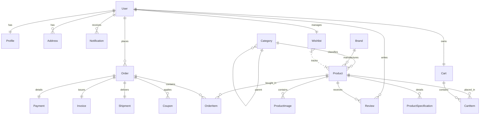
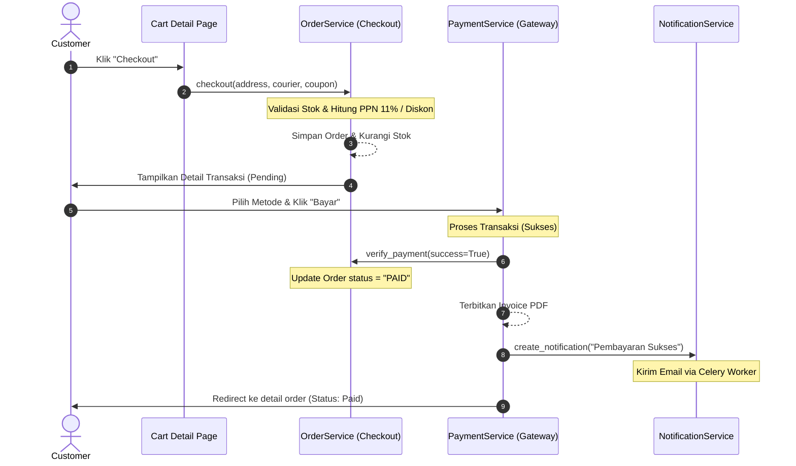

# ElectroShop - E-Commerce Industri Elektronik (Django 5)

A professional, scalable, clean, and production-ready Electronic E-Commerce web application built using **Django 5**, **Django REST Framework (DRF)**, **PostgreSQL**, **Redis Cache**, and **Celery**. 

The application utilizes Clean Architecture principles, implementing the **Service Layer** and **Repository Pattern** to decouple database queries from business logical actions.

---

## 📂 Struktur Folder Proyek

```
workspace/
├── manage.py
├── requirements.txt
├── .env.example
├── README.md
├── electro_shop/
│   ├── settings.py
│   ├── urls.py
│   ├── celery.py
│   ├── wsgi.py
│   └── asgi.py
├── apps/
│   ├── users/            # Pengguna, Profile, Alamat
│   ├── products/         # Kategori, Brand, Detail Produk, Spesifikasi, Review
│   ├── orders/           # Keranjang Belanja, Transaksi Order, Pengiriman, Wishlist
│   ├── payments/         # Pembayaran, Invoice PDF
│   ├── coupons/          # Kupon Voucher Diskon
│   ├── notifications/    # Notifikasi Sistem, In-App, Email Celery Tasks
│   └── dashboard/        # Custom Admin Dashboard & Ekspor Laporan
├── api/                  # REST API Serializers, ViewSets, & Routing
├── templates/            # HTML5 Templates (Customer & Admin views)
├── static/               # File Statis (CSS styling, JS scripts, images)
└── docker/               # Dockerfile, docker-compose, & Nginx proxy config
```

---

## 📊 Database Schema (ERD)



---

## 📐 UML Diagrams

### 1. Use Case Diagram
- **Customer**: Registrasi, Login, Mengatur Profil/Alamat, Jelajah Katalog Produk, Mengelola Keranjang/Wishlist, Menggunakan Kupon Diskon, Checkout & Simulasi Pembayaran, Lacak Pengiriman, Berikan Ulasan.
- **Admin / Super Admin**: Monitor Ringkasan Penjualan, CRUD Produk/Kategori/Brand/Kupon, Kelola Transaksi & Resi Pengiriman, Blokir/Banned User, Ekspor Laporan Penjualan (Excel, CSV, PDF).

### 2. Sequence Diagram - Checkout & Payment Flow


---

## 🔌 API Documentation

### Authentication Endpoints
* **POST `/api/token/`**: Mengambil access token (JWT) & refresh token dengan email dan password.
* **POST `/api/token/refresh/`**: Memperbarui access token yang telah kadaluwarsa.
* **POST `/api/auth/register/`**: Registrasi user baru (role otomatis CUSTOMER).
* **GET/PUT `/api/auth/profile/`**: Mengambil atau memperbarui avatar & bio profile.

### Catalog Endpoints
* **GET `/api/products/`**: Daftar produk aktif.
  * *Query Params*: `search` (pencarian), `category` (slug kategori), `brand` (slug brand), `sort_by` (`price_low`, `price_high`, `newest`).
* **GET `/api/products/<slug>/`**: Detail spesifikasi & gambar produk.

### Shopping Flow Endpoints
* **GET `/api/cart/`**: Detail isi keranjang belanja user.
* **POST `/api/cart/add/`**: Menambahkan barang. Payload: `{ "product_id": 1, "quantity": 1 }`.
* **POST `/api/orders/`**: Melakukan checkout belanjaan. Payload: `{ "address_id": 1, "courier": "JNE", "coupon_code": "DISKON10" }`.
* **POST `/api/payments/<order_id>/pay-simulated/`**: Menyelesaikan pembayaran (simulasi).

---

## 🚀 Panduan Instalasi Lokal

### Prasyarat
- Python 3.10 atau lebih baru.
- Virtual Environment (`venv` / `virtualenv`).

### Langkah Jalankan Aplikasi
1. **Ekstrak & Masuk ke Folder Proyek**
   ```bash
   cd "Project UAS"
   ```

2. **Buat & Aktifkan Virtual Environment**
   ```bash
   python -m venv venv
   # Di Windows (PowerShell):
   .\venv\Scripts\Activate.ps1
   # Di Linux/macOS:
   source venv/bin/activate
   ```

3. **Install Dependensi**
   ```bash
   pip install -r requirements.txt
   ```

4. **Lakukan Migrasi Database (SQLite default dev)**
   ```bash
   python manage.py makemigrations
   python manage.py migrate
   ```

5. **Buat Akun Administrator (Super Admin)**
   ```bash
   python manage.py createsuperuser
   ```
   *Isi email, username, dan kata sandi baru. Setelah dibuat, masuk ke database lalu ubah field `role` user tersebut menjadi `SUPER_ADMIN`.*

6. **Jalankan Server Lokal**
   ```bash
   python manage.py runserver
   ```
   *Buka browser dan buka alamat: [http://127.0.0.1:8000](http://127.0.0.1:8000)*

---

## 🐳 Panduan Deployment Docker (Production Ready)

Proyek ini telah dilengkapi dengan kontainerisasi Docker lengkap, menggunakan Gunicorn sebagai server aplikasi dan Nginx sebagai reverse proxy.

1. **Pastikan Docker Desktop & Docker Compose Terpasang**
2. **Jalankan Perintah Compose**
   ```bash
   cd docker
   docker-compose up --build -d
   ```
3. **Lakukan Migrasi & Buat Superuser di Dalam Container**
   ```bash
   docker-compose exec web python manage.py migrate
   docker-compose exec web python manage.py createsuperuser
   ```
4. **Selesai!**
   - Nginx akan berjalan pada port `80` (Akses langsung: [http://localhost](http://localhost))
   - PostgreSQL berjalan pada port `5402` di host
   - Redis berjalan pada port `6379`
